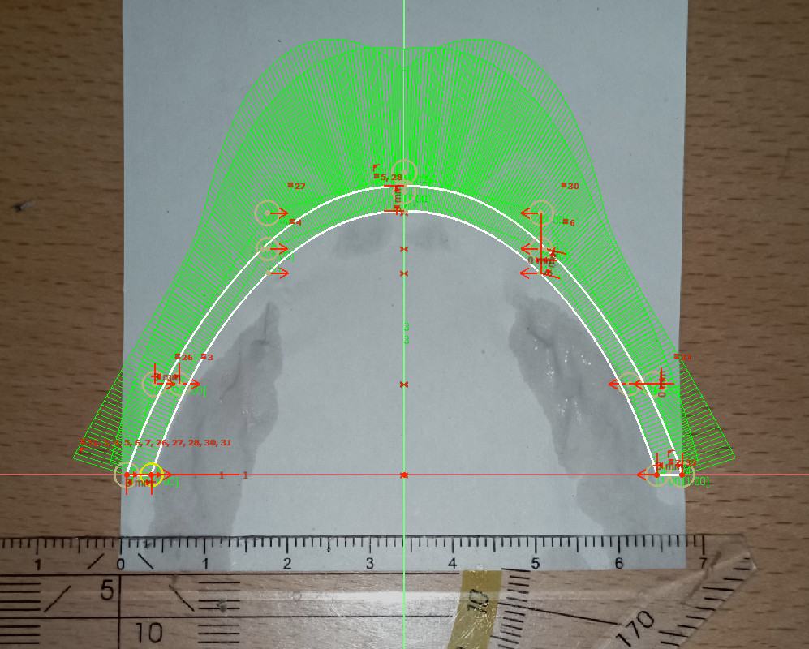
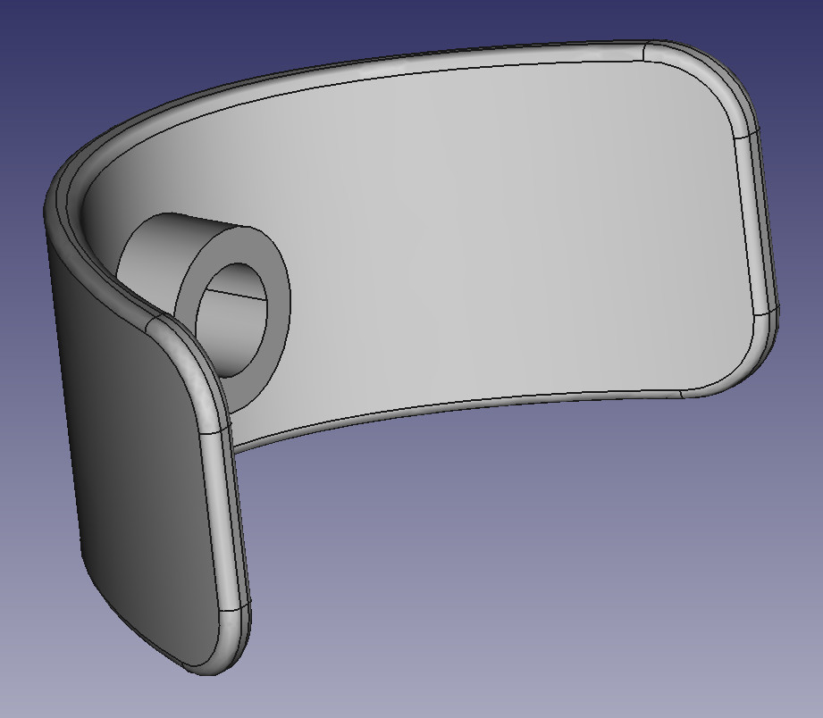
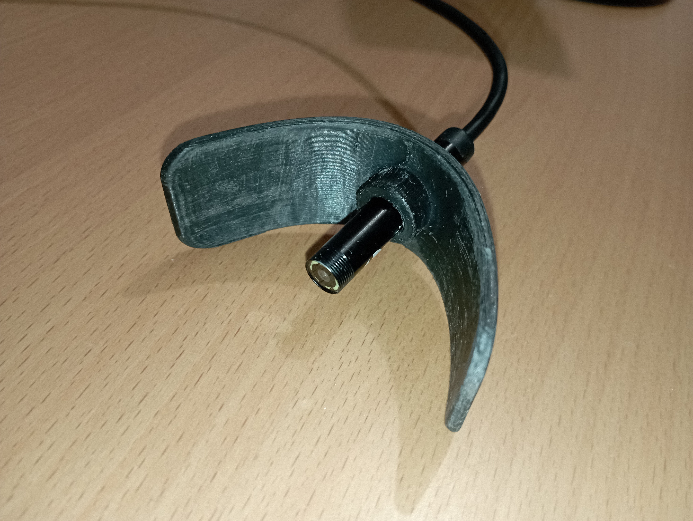
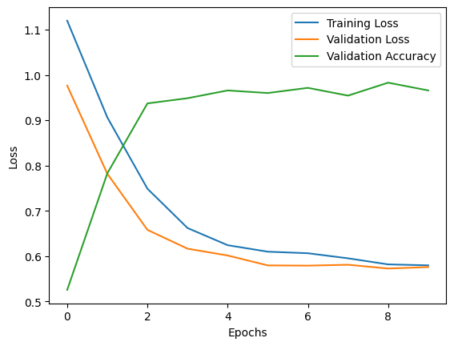
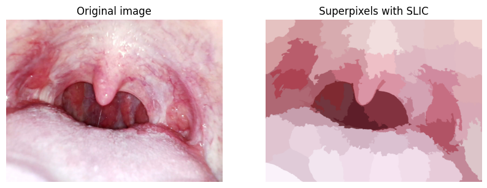
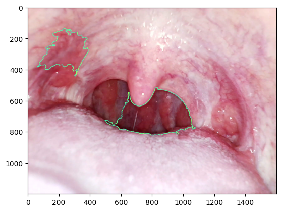
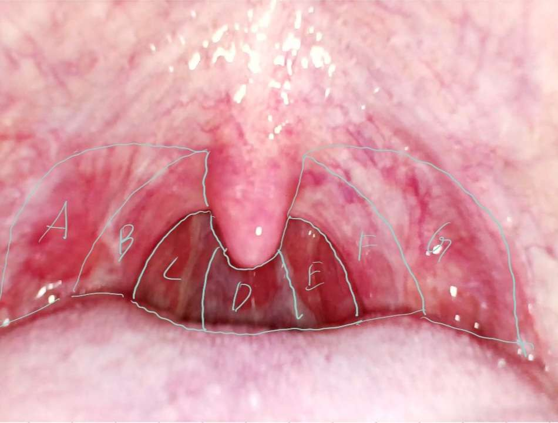
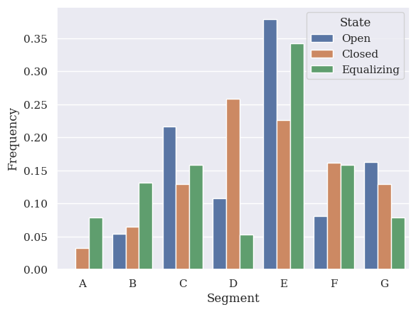
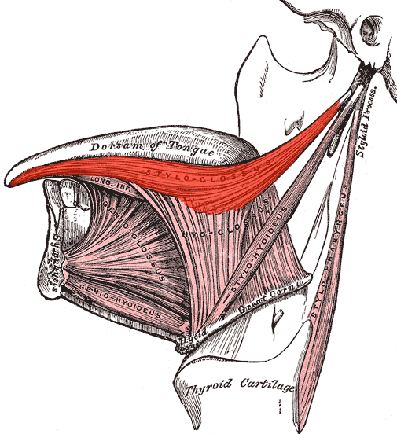

# Pharynx CV

This project aims to investigate the muscular activation in the mouth and throat during equalizing. Equalizing is the process in which the pressure in the middle ear is equalized with the pressure in the environment by opening the Eustachian tube. It is a common technique used by scuba divers to prevent Barotrauma.
There are two types of equalizing: Valsalva and Frenzel. Both techniques involve closing the mouth and nose and blowing air into the Eustachian tube. In the Valsalva technique, the air is blown from the lungs, while in the Frenzel technique, the necessary pressure is generated by the tongue and throat muscles while closing the Glottis. What I want to find out is which muscles are used in the Frenzel technique.
To achieve this, I will take pictures of the mouth and throat area during three states:
- Resting (open Glottis)
- Conscious closing of the Glottis
- Frenzel equalizing

I will then use transfer learning to train a pretrained ResNet18 Model to classify the images into these three categories and use segmentation and LIME to find out which parts of the image are most important for the classification.

## Data
The pictures were taken with a €20 endoscope from Amazon. The endoscope was held in place by a 3D-printed holder. To design the endoscope holder, I bit on a piece of paper and imported the image into [FreeCAD](https://www.freecadweb.org/) to sketch the design. 

The endoscope holder was printed with an [Anycubic Kobra 2 Neo](https://www.anycubic.com/products/kobra-2-neo) with a 0.4mm nozzle and 0.2mm layer height.
 
In total, I took about 200 pictures per category. The images were resized to 256x256 pixels and then used random rotations of up to 10 degrees and random crops to 224x224 pixels to augment the data and normalized with the mean and standard deviation of the ImageNet dataset.

## Training
The model was trained in [notebooks/train.ipynb](notebooks/train.ipynb) on a RTX 3070. I used Cross Entropy Loss with label smoothing and SGD with momentum and weight decay as the optimizer. The model was trained for 10 epochs, with a learning rate reduction of a factor of 10 after 5 epochs.

On the validation set, the model achieved an accuracy of 98.86%. 

## Segmentation
To find out which parts of the image were most important for the classification, I used segmentation and LIME. As segmentation algorithm, I used the SLIC algorithm from the [scikit-image](https://scikit-image.org/) library. 

I then used the `LimeImageExplainer` from [LIME](https://lime-ml.readthedocs.io/en/latest/index.html) to find out which superpixels were most important for the classification. The segmentation and analysis were done in [notebooks/lime_superpixels.ipynb](notebooks/lime_superpixels.ipynb). 

## Analysis
I computed the 3 most important superpixels for each image in [scripts/lime_superpixels.py](scripts/lime_superpixels.py), split the mouth and throat into the regions shown below, and counted for each category how often each region was among the 3 most important superpixels.

## Conclusion
Comparing the frequencies, it seems like Frenzel equalization is more associated with the relaxed state, but with a higher activation in the regions `B` and `F` to the sides. 
A possible explanation of the closer resemblance to the relaxed state, even though Frenzel equalization involves closing the Glottis, could be that the conscious closing of the Glottis exaggerates the activation of the muscles in the front of the Pharynx, while the Frenzel equalization is more focused on the back of the Pharynx. 
The high activations of the side regions `B` and `F` could point to an involvement of the Styloglossus muscle, which attaches to the back and to the side of the tongue, and the Stylohyoideus muscle, which attaches to the back and to the side of the Hyoid bone.

Source: [https://en.wikipedia.org/wiki/Styloglossus](https://en.wikipedia.org/wiki/Styloglossus)
